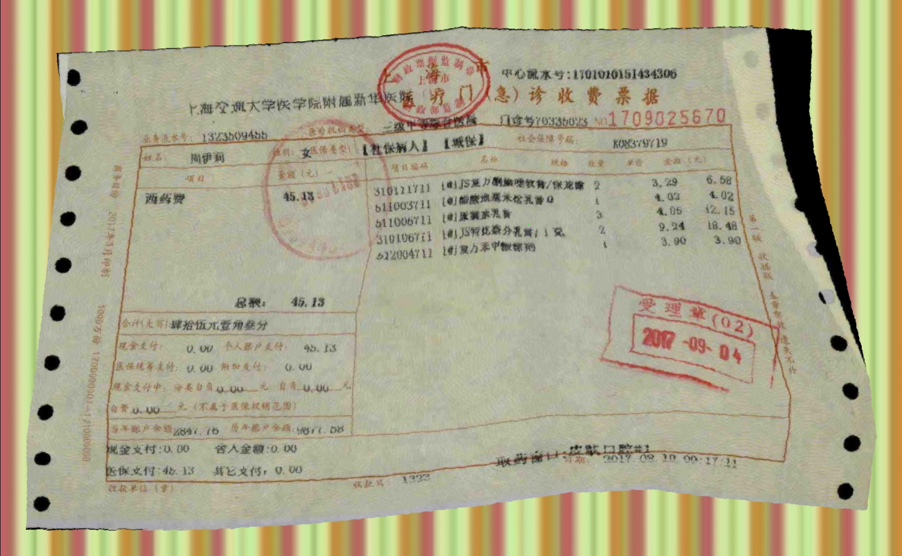
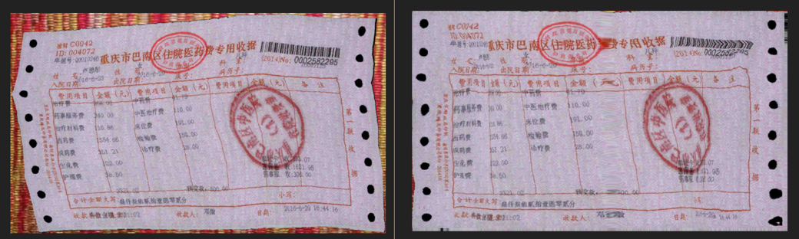
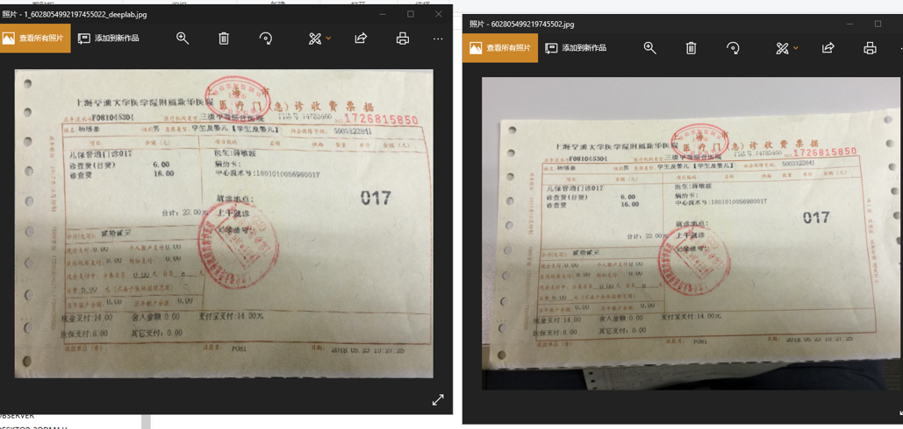

# DocUNet: Document Image Unwarping via A Stacked U-Net

[paper](https://www3.cs.stonybrook.edu/~cvl/content/papers/2018/Ma_CVPR18.pdf) [zhihu](https://zhuanlan.zhihu.com/p/37306349)

## how to run

1. prepare some scans and background images
2. use flow scipt to generated some images and labels
```python
python3 data_generator/generator.py -i scan_images_path -b background_images_path -o output_path
```
3. change `trainroot` in `config.py`
4. use flow scipt to train
```python
python3 train.py
```

## how to eval
1. change `model_path` and `img_path` in `predict.py`
2. use flow scipt to train
```python
python3 predict.py
```

## generated images sample


## result
result on training data

left：input, right output


result on really data

left：output, right input
